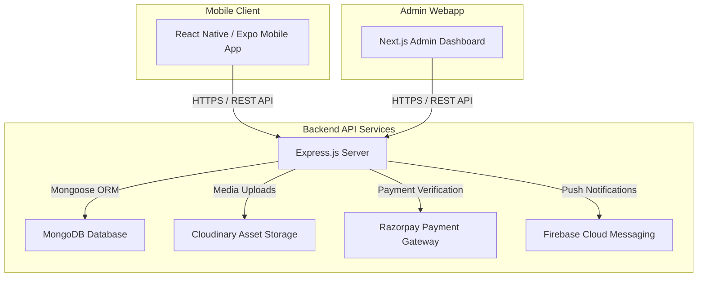

# NovaEdge Digital Labs — Application Overview

Welcome to the **NovaEdge Digital Labs** platform. NovaEdge Digital Labs is a full-stack digital product studio ecosystem designed to deliver digital services, courses, a freelance & job marketplace, a digital store, and business solutions.

---

## 🌟 Architecture Overview

The repository is structured as a monorepo containing three core components:

```
novaedge-digital-labs-app/
├── 📱 frontend/       # Cross-platform Mobile App (Expo SDK 55, React Native, TypeScript)
├── ⚙️ backend/        # RESTful API Server (Node.js, Express, MongoDB, JWT)
└── 🖥️ admin-webapp/   # Admin Control Dashboard (Next.js App Router, Tailwind CSS, Framer Motion)
```

### High-Level System Architecture



---

## 📱 1. Mobile Application (`/frontend`)

The mobile application is a cross-platform app built for Android and iOS providing seamless access to courses, marketplace, job listings, and company services.

### Key Technologies
- **Framework:** Expo (v55) / React Native (v0.83)
- **Language:** TypeScript
- **State Management:** Zustand
- **Navigation:** React Navigation (Native Stack & Bottom Tabs)
- **UI & Iconography:** Lucide Icons, Expo Linear Gradient, React Native Reanimated
- **Integrations:** Razorpay React Native SDK, Expo Notifications, Expo Video, React Native QR Code SVG

### Core Mobile Features
- **User Authentication:** Login, Register, Profile Management, Role Switching (Seeker / Freelancer / Employer).
- **Course Learning Hub:** Course catalog, video lessons, downloadable resources, course completion tracking.
- **Freelance & Job Board:** Search job listings, post job openings, browse freelance gigs, apply with candidate proposals.
- **Digital Store:** Browse digital templates, software tools, and service packages with direct Razorpay payment integration.
- **Engagement & UX:** Dark mode UI, daily login/reward points system, micro-animations, and live activity tracking.

---

## ⚙️ 2. Backend API (`/backend`)

The backend is an Express.js API powering all data operations, user sessions, role-based authorization, payment flows, and content delivery.

### Key Technologies
- **Runtime:** Node.js & Express.js
- **Database:** MongoDB with Mongoose ORM
- **Authentication:** JSON Web Tokens (JWT) & bcryptjs password hashing
- **File & Media Storage:** Cloudinary & Multer
- **Communications:** Nodemailer (SMTP transactional emails), Firebase Admin (Push notifications)
- **Integrations:** Razorpay (Payments), Puppeteer (PDF/Certificate generation), RSS Parser, Sharp (Image processing)

### Backend Capabilities & Domain Controllers
1. **User & Auth Controller:** User creation, JWT authentication, profile management, role verification (`admin`, `user`).
2. **Courses & Learning Controller:** Course CRUD, enrollment tracking, progress updates, certificate generation.
3. **Jobs & Gigs Controller:** Job listing moderation, candidate application pipelines, contract & escrow state tracking.
4. **Digital Store Controller:** Products & Services management, transaction recording, order history tracking.
5. **Leads & Inquiries Controller:** Capturing business leads, contact inquiries, automatic email alerts to admins.
6. **Admin & Developer API:** Dynamic platform configuration (`PlatformConfig`), API key generation/revocation, platform analytics aggregation (`ToolUsage`, `Analytics`).

---

## 🖥️ 3. Admin Webapp (`/admin-webapp`)

The admin webapp provides an internal management dashboard for system admins to monitor platform metrics, manage users, curate store items, configure platform settings, and issue developer API keys.

### Key Technologies
- **Framework:** Next.js (App Router, v16)
- **Styling:** Tailwind CSS (v4), Framer Motion, GSAP animations, Glassmorphism design system
- **UI Components:** Lucide Icons, Sonner toasts
- **State & API Handling:** Custom API client layer with automatic token injection

### Main Admin Modules
| Route | Page | Purpose |
|---|---|---|
| `/` | Dashboard | Platform statistics overview (users, courses, revenue, tool usage), recent signups |
| `/login` | Login | Glassmorphic admin authentication gate with JWT verification |
| `/store` | Store Management | Full CRUD operations for digital products & services |
| `/users` | User Directory | User listing, role promotion/demotion, account status toggles |
| `/analytics` | Analytics Center | Performance metrics visualization and CSV export |
| `/domain` | Domain Setup | Domain allow-listing, DNS records management, SSL status |
| `/settings` | Platform Settings | 8-tab configuration (Security, Team, API Keys, Database, Appearance) |

---

## 🛠️ Technology Stack Summary

| Layer | Primary Tech | Supporting Tools & Libraries |
|---|---|---|
| **Mobile App** | React Native, Expo 55, TypeScript | Zustand, React Navigation, Reanimated, Razorpay SDK |
| **Admin Webapp** | Next.js 16 (App Router), TypeScript | Tailwind CSS v4, Framer Motion, Lucide React, Sonner |
| **Backend Server** | Node.js, Express.js | Mongoose, Cloudinary, Nodemailer, Puppeteer, Helmet |
| **Database** | MongoDB | Mongoose Schemas & Indexes |
| **Deployment** | EAS (Mobile), Vercel/Render (Backend/Web) | Docker / Node production environment |

---

## 🚀 Getting Started Locally

### 1. Prerequisites
- Node.js (v18+)
- npm or yarn
- Running MongoDB instance or MongoDB Atlas URI

### 2. Running the Backend
```bash
cd backend
npm install
# Create .env based on .env.example
npm run dev
# Backend API runs on http://localhost:5000/api
```

### 3. Running the Mobile App
```bash
cd frontend
npm install
npm start
# Press 'a' for Android emulator or 'w' for Web
```

### 4. Running the Admin Webapp
```bash
cd admin-webapp
npm install
npm run dev
# Admin dashboard runs on http://localhost:3000
```

---

## 📄 Related Documentation
- [README.md](file:///home/amit/old_data/Development/myProject/novaedge-digital-labs-app/README.md) — Quick setup instructions
- [admin_webapp_architecture.md](file:///home/amit/old_data/Development/myProject/novaedge-digital-labs-app/admin_webapp_architecture.md) — Admin Webapp full-stack architecture analysis
- [backend_integration.md](file:///home/amit/old_data/Development/myProject/novaedge-digital-labs-app/backend_integration.md) — Detailed backend capability breakdown
- [features.md](file:///home/amit/old_data/Development/myProject/novaedge-digital-labs-app/features.md) — Feature recommendations & user retention strategy
- [deployment.md](file:///home/amit/old_data/Development/myProject/novaedge-digital-labs-app/deployment.md) — Deployment & production build setup
